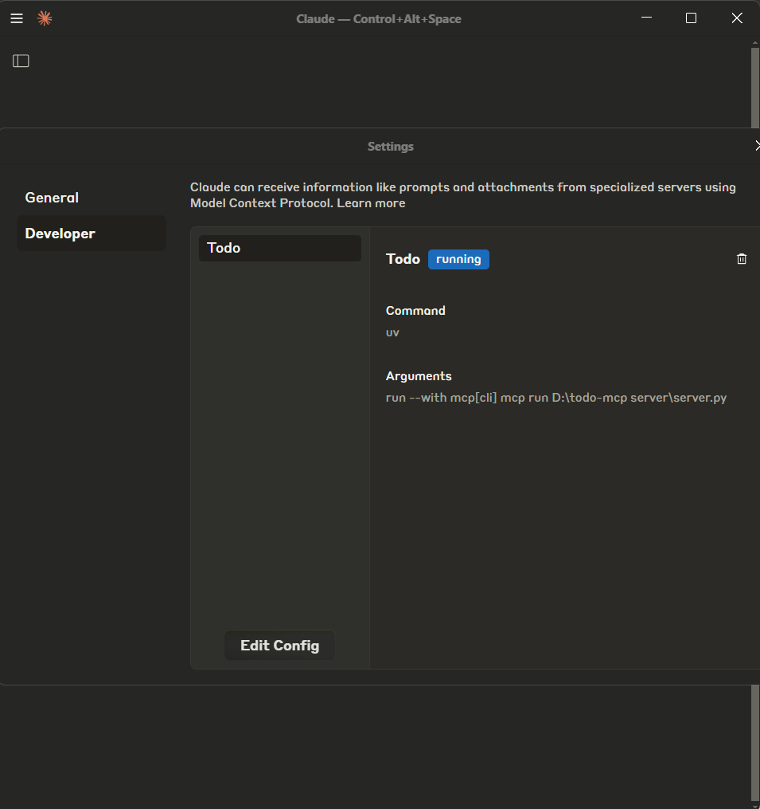

# Todo MCP Server

This repository provides an **MCP (Model Context Protocol)** server for interacting with the [Todo App](https://github.com/Adhishtanaka/todo-app) through Claude and other MCP-compatible AI tools. This project allows AI agents to access and manage todos using the standardized MCP interface.



## Overview

The MCP server uses the **Python SDK** to expose a REST API (built with **Next.js**, hosted on **Netlify**) to MCP-compatible clients. It acts as a lightweight protocol server to retrieve, create, update, and delete todos.

### Powered by:
- **Python SDK** for [MCP](https://github.com/modelcontextprotocol/python-sdk)
- **Next.js API routes**
- **Prisma ORM + PostgreSQL**
- **JWT-based auth**

---

## Features

- Exposes Todo API operations as MCP tools
- Retrieves todos via `@mcp.resource`
- Supports create, update, delete, and mark-as-complete
- Works with Claude’s chat UI for seamless interaction

---

## Installation & Usage

### 1. Clone the Repository
```bash
git clone https://github.com/Adhishtanaka/todo-mcp-server.git
cd todo-mcp-server
```

### 2. Install Python Dependencies
```bash
pip install -r requirements.txt
```

### 3. Create a `.env` File
Create a `.env` file and add your JWT `TOKEN`:
```env
TOKEN=your_jwt_token_here
```

### 4. Run the MCP Server
```bash
mcp install server.py
```


---

## Notes

- This server is built for educational and integration purposes
- Add rate limiting, logging, and error handling for production use
- Secure token handling is essential in deployment

---

## License

This project is licensed under the [MIT License](LICENSE).

---

## Author

- **Adhishtanaka Thiramithu Kulasooriya**
- GitHub: [@Adhishtanaka](https://github.com/Adhishtanaka)
- Email: kulasoooriyaa@gmail.com
